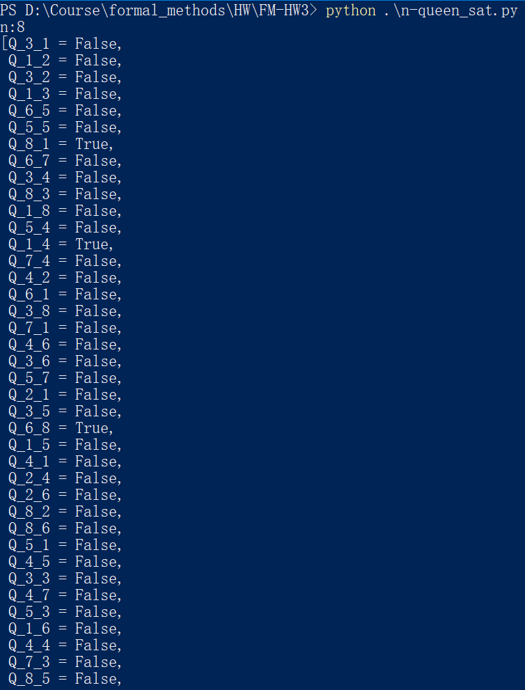
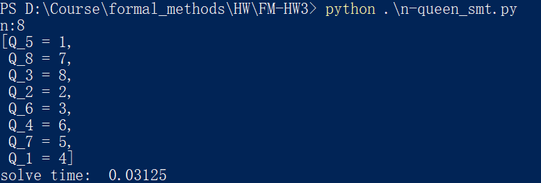
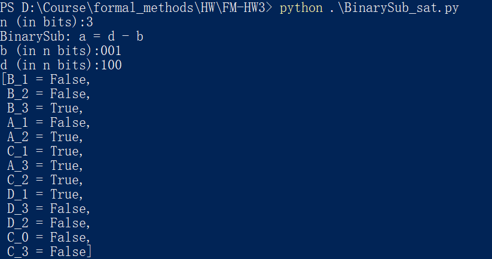
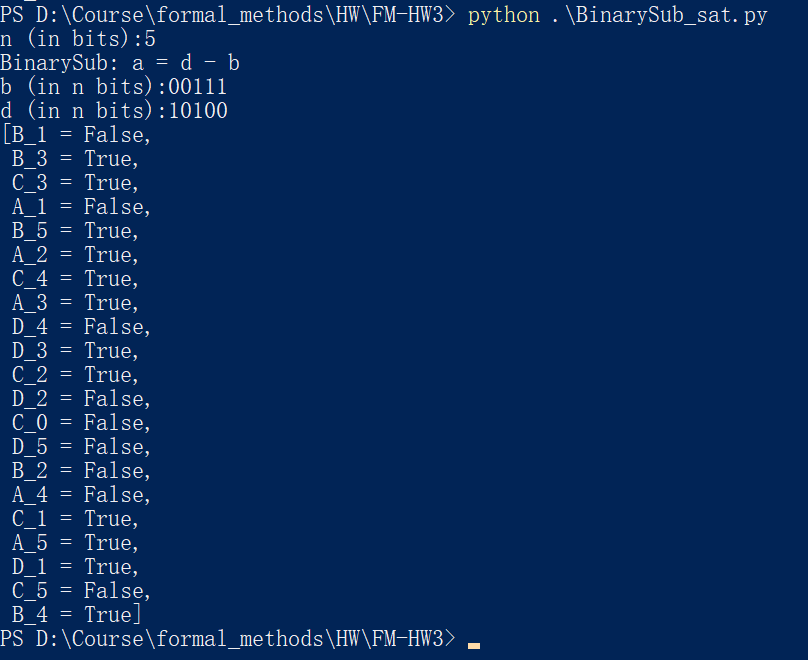

# FM-HW 3

## 1 N-Queen问题的SAT和SMT求解

### 实验记录

SAT(n=8):

SMT(n=8):

### SMT/SAT性能比较

| n    | SMT time(s) | SAT time(s) |
| ---- | ----------- | ----------- |
| 5    | 0.015625    | 0.015625    |
| 10   | 0.03125     | 0.109375    |
| 15   | 0.171875    | 0.484375    |
| 20   | 0.40625     | 1.40625     |

理论上：SAT solver的性能相对SMT solver更好，所需时间应该更短；

实际上：性能的发挥与程序员的工程水平有很大关系，在程序员水平欠佳的情况下，SAT solver的性能可能会比SMT solver更差。

## 2 用pure-SAT解决二进制减法问题

 ### 编码思路

$$
d_i \leftrightarrow (a_i \leftrightarrow (b_i \leftrightarrow c_i))\\
c_{i-1} \leftrightarrow ((a_i \and b_i)\or(a_i \and c_i)\or(b_i \and c_i))\\
\neg c_n\\
\neg c_0
$$

以上命题约束了$d=a+b$在n个二进制位且无进位的情况下的运算法则。通过逻辑命题给出$b$和$d$的初始条件，就可以通过SAT solver给出$a$的可能取值。即求解
$$
a=d-b\\
\text{b and d are desribed in logic proposition}
$$
在实际的编码过程中，$c_0$需要被单独进行处理（或者改变命题中$c$的下标），以防止越界的情况发生。编码中各约束条件的意义如下：

| 约束条件            | 意义                                                         |
| ------------------- | ------------------------------------------------------------ |
| `b_c`               | 根据二进制数b给出其逻辑命题描述                              |
| `d_c`               | 根据二进制数d给出其逻辑命题描述                              |
| `sum_c`             | $d_i \leftrightarrow (a_i \leftrightarrow (b_i \leftrightarrow c_i))$ |
| `carry_c`           | $c_{i-1} \leftrightarrow ((a_i \and b_i)\or(a_i \and c_i)\or(b_i \and c_i))$，当$i \geq 2$ |
| `leftmost_carry`    | $c_{i-1} \leftrightarrow ((a_i \and b_i)\or(a_i \and c_i)\or(b_i \and c_i))$，当$i =1$ |
| `leftmost_carry_c`  | $\neg c_0$                                                   |
| `rightmost_carry_c` | $\neg c_n$                                                   |

### 使用文档

$$
a=d-b
$$

1. 输入操作数在二进制下的位数n；
2. 使用二进制（0/1串）输入b的值，保证输入为n位；
3. 使用二进制（0/1串）输入d的值，保证输入为n位；
4. SAT solver给出结果；

### 实验结果

