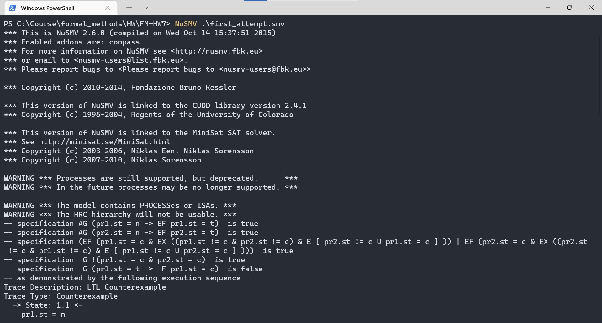
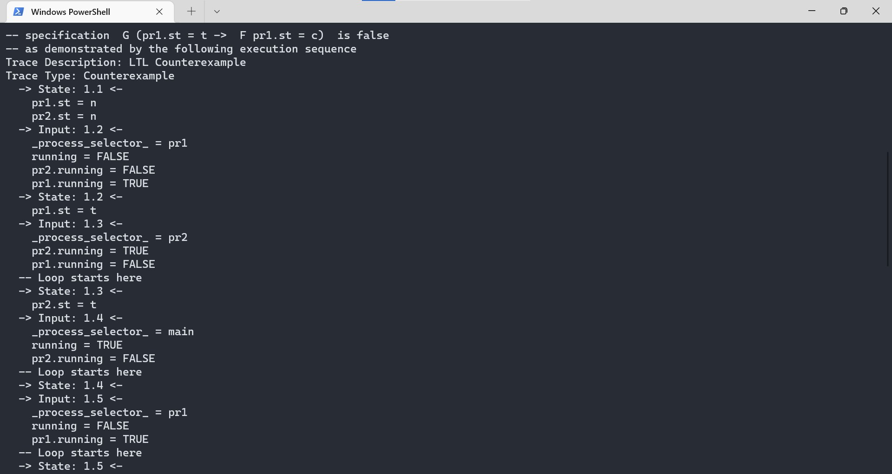
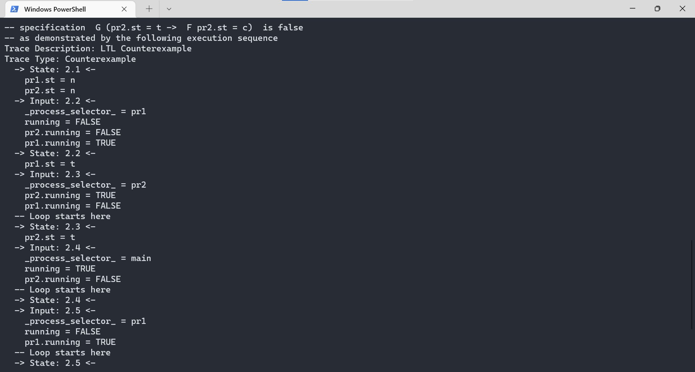

# FM-HW7

## CTL设计说明

### 1 Non-blocking

Non-blocking要求对于所有路径上的全部结点均满足：如果当前n1为真，则存在该结点后续某一路径的某一结点满足t1；类似的，如果当前n2为真，则存在该结点后续某一路径的某一结点满足t2。NuSMV上的CTL描述如下所示：

```NuSMV
CTLSPEC AG((pr1.st = n) -> EF (pr1.st = t))
CTLSPEC AG((pr2.st = n) -> EF (pr2.st = t))
```

### 2 No strict Sequencing

No strict Sequencing要求在某一路径上存在两个满足c1的结点，它们中间的结点（至少有一个）既不能满足c1，也不能满足c2；或者存在某一路径满足其镜像情况（即某一路径上存在两个满足c2的结点，它们中间的结点（至少有一个）既不能满足c1，也不能满足c2）。NuSMV上的CTL描述如下所示：

```NuSMV
CTLSPEC (EF((pr1.st = c) & EX((pr1.st != c) & (pr2.st != c) & E[(pr2.st != c) U (pr1.st = c)]))) | (EF((pr2.st = c) & EX((pr2.st != c) & (pr1.st != c) & E[(pr1.st != c) U (pr2.st = c)])))
```

## 验证结果

在Window PowerShell下执行如下指令

```powershell
> NuSMV ./first_attempts.smv
```

所得结果如下：



可以看到Safety、Non-blocking、No strict sequencing三条性质均得到了满足。两条关于Living的目标没有得到满足，并找到了对应的反例。结果分别如下所示：





详细的log结果如下所示。

```log
-- specification AG (pr1.st = n -> EF pr1.st = t)  is true
-- specification AG (pr2.st = n -> EF pr2.st = t)  is true
-- specification (EF (pr1.st = c & EX ((pr1.st != c & pr2.st != c) & E [ pr2.st != c U pr1.st = c ] )) | EF (pr2.st = c & EX ((pr2.st != c & pr1.st != c) & E [ pr1.st != c U pr2.st = c ] )))  is true
-- specification  G !(pr1.st = c & pr2.st = c)  is true
-- specification  G (pr1.st = t ->  F pr1.st = c)  is false
-- as demonstrated by the following execution sequence
Trace Description: LTL Counterexample
Trace Type: Counterexample
  -> State: 1.1 <-
    pr1.st = n
    pr2.st = n
  -> Input: 1.2 <-
    _process_selector_ = pr1
    running = FALSE
    pr2.running = FALSE
    pr1.running = TRUE
  -> State: 1.2 <-
    pr1.st = t
  -> Input: 1.3 <-
    _process_selector_ = pr2
    pr2.running = TRUE
    pr1.running = FALSE
  -- Loop starts here
  -> State: 1.3 <-
    pr2.st = t
  -> Input: 1.4 <-
    _process_selector_ = main
    running = TRUE
    pr2.running = FALSE
  -- Loop starts here
  -> State: 1.4 <-
  -> Input: 1.5 <-
    _process_selector_ = pr1
    running = FALSE
    pr1.running = TRUE
  -- Loop starts here
  -> State: 1.5 <-
  -> Input: 1.6 <-
    _process_selector_ = pr2
    pr2.running = TRUE
    pr1.running = FALSE
  -- Loop starts here
  -> State: 1.6 <-
  -> Input: 1.7 <-
    _process_selector_ = main
    running = TRUE
    pr2.running = FALSE
  -> State: 1.7 <-
-- specification  G (pr2.st = t ->  F pr2.st = c)  is false
-- as demonstrated by the following execution sequence
Trace Description: LTL Counterexample
Trace Type: Counterexample
  -> State: 2.1 <-
    pr1.st = n
    pr2.st = n
  -> Input: 2.2 <-
    _process_selector_ = pr1
    running = FALSE
    pr2.running = FALSE
    pr1.running = TRUE
  -> State: 2.2 <-
    pr1.st = t
  -> Input: 2.3 <-
    _process_selector_ = pr2
    pr2.running = TRUE
    pr1.running = FALSE
  -- Loop starts here
  -> State: 2.3 <-
    pr2.st = t
  -> Input: 2.4 <-
    _process_selector_ = main
    running = TRUE
    pr2.running = FALSE
  -- Loop starts here
  -> State: 2.4 <-
  -> Input: 2.5 <-
    _process_selector_ = pr1
    running = FALSE
    pr1.running = TRUE
  -- Loop starts here
  -> State: 2.5 <-
  -> Input: 2.6 <-
    _process_selector_ = pr2
    pr2.running = TRUE
    pr1.running = FALSE
  -- Loop starts here
  -> State: 2.6 <-
  -> Input: 2.7 <-
    _process_selector_ = main
    running = TRUE
    pr2.running = FALSE
  -> State: 2.7 <-
```

