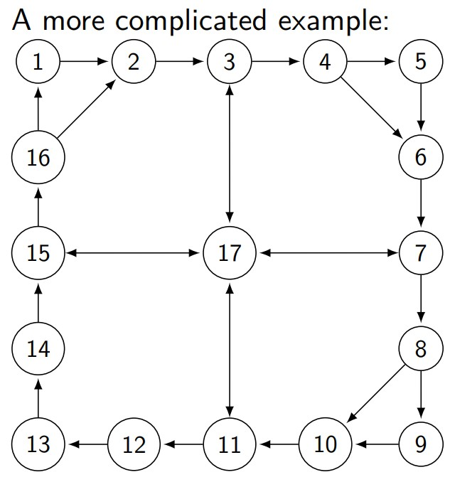
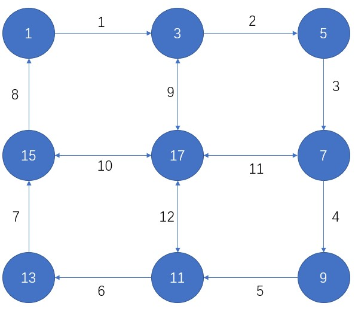
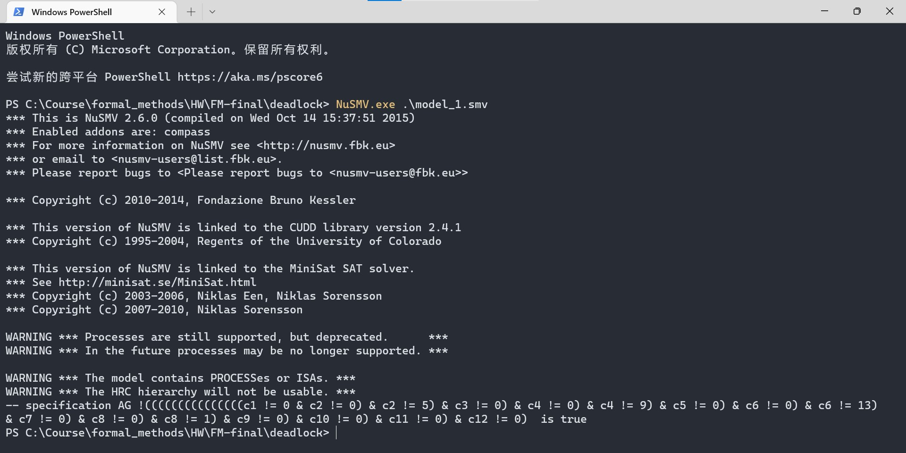
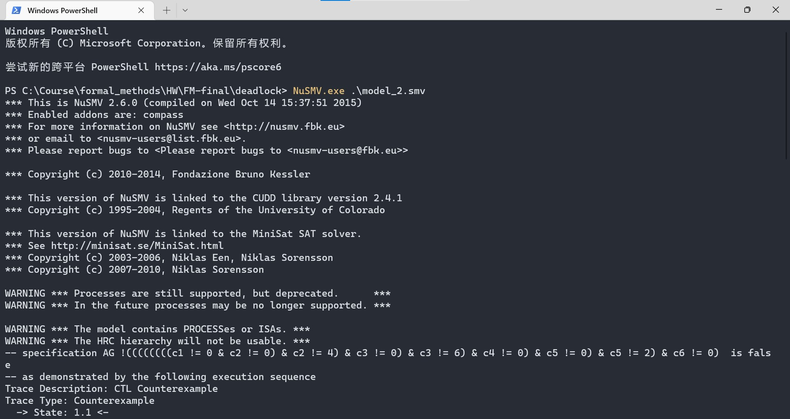
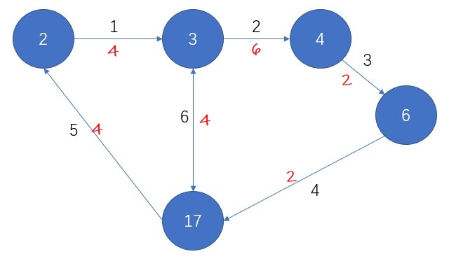

# FM-Final Project

## 实验1 Deadlock Verification with NuSMV

### 模型简化



当$M=\{1, 5, 9, 13\}$时，由于路径需要是最短路径，同时非主结点（main nodes）中的中继结点（即一进边一出边的结点）的有无不会影响deadlock存在与否的判断，故模型可简化如下（同时对边进行编号）：



类似的，当$M=\{2, 4, 6\}$时，模型可以简化如下：


### 实验结果

#### model 1

$M=\{1, 5, 9, 13\}$



可以看到CTL目标语句的验证结果为true，说明在当前模型下，deadlock状态是不可达的。同时，由于我们进行了模型简化，并且对各个节点的后续状态做出了一定约束（参见NuSMV实现部分），故NuSMV可以在10秒之内对该模型进行验证。

#### model 2

$M=\{2, 4, 6\}$



可以看到CTL目标语句的验证结果为false，说明在当前模型下，deadlock状态是可达的。NuSMV给出的CTL Counterexample如下所示：

```
-- specification AG !((((((((c1 != 0 & c2 != 0) & c2 != 4) & c3 != 0) & c3 != 6) & c4 != 0) & c5 != 0) & c5 != 2) & c6 != 0)  is false
-- as demonstrated by the following execution sequence
Trace Description: CTL Counterexample
Trace Type: Counterexample
  -> State: 1.1 <-
    c1 = 0
    c2 = 0
    c3 = 0
    c4 = 0
    c5 = 0
    c6 = 0
    pr2.st = s
    pr4.st = s
    pr6.st = s
    pr3.st = p_in
    pr17.st = p_in
  -> Input: 1.2 <-
    _process_selector_ = pr2
    running = FALSE
    pr17.running = FALSE
    pr3.running = FALSE
    pr6.running = FALSE
    pr4.running = FALSE
    pr2.running = TRUE
  -> State: 1.2 <-
    c1 = 6
  -> Input: 1.3 <-
    _process_selector_ = pr4
    pr4.running = TRUE
    pr2.running = FALSE
  -> State: 1.3 <-
    c3 = 2
  -> Input: 1.4 <-
    _process_selector_ = pr6
    pr6.running = TRUE
    pr4.running = FALSE
  -> State: 1.4 <-
    c4 = 4
  -> Input: 1.5 <-
    _process_selector_ = pr17
    pr17.running = TRUE
    pr6.running = FALSE
  -> State: 1.5 <-
    c4 = 0
    c5 = 4
    c6 = 4
  -> Input: 1.6 <-
    _process_selector_ = pr6
    pr17.running = FALSE
    pr6.running = TRUE
  -> State: 1.6 <-
    c4 = 2
  -> Input: 1.7 <-
    _process_selector_ = pr3
    pr3.running = TRUE
    pr6.running = FALSE
  -> State: 1.7 <-
    c1 = 0
    c2 = 6
  -> Input: 1.8 <-
    _process_selector_ = pr2
    pr3.running = FALSE
    pr2.running = TRUE
  -> State: 1.8 <-
    c1 = 4
```

根据以上的结果，一个可以达到的deadlock状态如下（在简化模型中）：



### NuSMV实现

#### 三类节点

##### main node

主节点是指唯一可以发送信息和接受信息的节点，在本次的实验的两个模型中，主节点均只有一个入边（`c_in`）和一个出边（`c_out`）。只要条件满足，主节点可以随时进行receive操作。对于send和process，由状态量`st`进行控制，一个节点发送的信息`m`不包含自己的`id`。具体实现如下：

```c
MODULE main_node(c_in, c_out, m, id)
    VAR
        st: {s, p};
    ASSIGN
        init(st) := {s, p};
        next(st) := {s, p};
        next(c_in) :=
            case
                (c_in = id): 0;
                (c_in != 0 & c_in != id & st = p & c_out = 0): 0;
                TRUE: c_in;
            esac;
        next(c_out) :=
            case
                (c_out = 0 & st = s): m;
                (c_in != 0 & c_in != id & st = p & c_out = 0): c_in;
                TRUE: c_out;
            esac;
    FAIRNESS running
```

##### bypass node

中继节点是指图中有一个入边（`c_in`）、一个出边（`c_out`）和一个既可入也可出的边（`c_inout`）的节点。为了进一步强化对模型的约束，以简化模型检测中的transition system的大小，我们进一步设置了`out_list`和`inout_list`。

`out_list`限制了出边上可能出现的值，`inout_list`限制了既可入也可出的边上可能出现的值。当`out_list`和`inout_list`都被设置为$M$时，即对边上可能出现的值不加任何约束（由于model 2的规模较小，我们并没有设计约束以进一步简化模型，直接将$M=\{2,4,6\}$传入函数）。通过状态量`st`判断当前process的是in边上的值还是inout边上的值。具体实现如下所示：

```c
MODULE bypass_node(c_in, c_out, c_inout, out_list, inout_list)
    VAR
        st: {p_in, p_inout};
    ASSIGN
        init(st) := {p_in, p_inout};
        next(st) := {p_in, p_inout};
        next(c_in) :=
            case
                (c_in != 0 & c_out = 0 & st = p_in & c_in in out_list): 0;
                (c_in != 0 & c_inout = 0 & st = p_in & c_in in inout_list): 0;
                TRUE: c_in;
            esac;
        next(c_out) :=
            case
                (c_in != 0 & c_out = 0 & st = p_in & c_in in out_list): c_in;
                (c_inout != 0 & c_out = 0 & st = p_inout & c_inout in out_list): c_inout;
                TRUE: c_out;
            esac;
        next(c_inout) :=
            case
                (c_inout != 0 & c_out = 0 & st = p_inout & c_inout in out_list): 0;
                (c_in != 0 & c_inout = 0 & st = p_in & c_in in inout_list): c_in;
                TRUE: c_inout;
            esac;
    FAIRNESS running
```

##### center node

中心节点仅在model 2中出现（即编号为17的节点），其连接四个既可入也可出的边，在函数中由`up`、`left`、`right`、`down`表示。由于中心节点只出现了一次，不需要传入参数以区分不同的情况，直接在函数内部对每个边可能出现的值进行了约束。由状态量`st`区分当前处理的是哪一条边。

例如：对于`up`（即图中的9号边），其作为入边时，由于最短路径原则，只可能传递来自1号结点去往9号（走11号边）或者13号（走12号边）的信息；其作为入边时，只可能传递来自13号或者9号结点去往5号结点的信息。由此可以大大减少trasition system中下一个状态可能的情况。


具体实现如下所示：

```c
MODULE center_node(up, left, right, down)
    VAR
        st: {p_up, p_left, p_right, p_down};
    ASSIGN
        init(st) := {p_up, p_left, p_right, p_down};
        next(st) := {p_up, p_left, p_right, p_down};
        next(up) :=
            case
                (up = 9 & right = 0 & st = p_up): 0;
                (up = 13 & down = 0 & st = p_up): 0;
                (left = 5 & up = 0 & st = p_left): 5;
                (down = 5 & up = 0 & st = p_down): 5;
                TRUE: up;
            esac;
        next(left) :=
            case
                (left = 5 & up = 0 & st = p_left): 0;
                (left = 9 & right = 0 & st = p_left): 0;
                (right = 1 & left = 0 & st = p_right): 1;
                (down = 1 & left = 0 & st = p_down): 1;
                TRUE: left;
            esac;
        next(right) :=
            case
                (right = 13 & down = 0 & st = p_right): 0;
                (right = 1 & left = 0 & st = p_right): 0;
                (up = 9 & right = 0 & st = p_up): 9;
                (left = 9 & right = 0 & st = p_left): 9;
                TRUE: right;
            esac;
        next(down) :=
            case
                (down = 1 & left = 0 & st = p_down): 0;
                (down = 5 & up = 0 & st = p_down): 0;
                (up = 13 & down = 0 & st = p_up): 13;
                (right = 13 & down = 0 & st = p_right): 13;
                TRUE: down;
            esac;
    FAIRNESS running
```

#### 两个模型

##### model 1


对于中继结点（bypass node），其出边上，只能出现距离出边最接近的主节点的值；其既可入也可出的边上，只能出现除距离入边最接近的主节点外其他所有主节点的值。具体配置如下所示：

```c
		c1: {0, 1, 5, 9, 13};
        c2: {0, 1, 5, 9, 13};
        c3: {0, 1, 5, 9, 13};
        c4: {0, 1, 5, 9, 13};
        c5: {0, 1, 5, 9, 13};
        c6: {0, 1, 5, 9, 13};
        c7: {0, 1, 5, 9, 13};
        c8: {0, 1, 5, 9, 13};
        c9: {0, 1, 5, 9, 13};
        c10: {0, 1, 5, 9, 13};
        c11: {0, 1, 5, 9, 13};
        c12: {0, 1, 5, 9, 13};

        pr1: process main_node(c8, c1, {5, 9, 13}, 1);
        pr5: process main_node(c2, c3, {1, 9, 13}, 5);
        pr9: process main_node(c4, c5, {1, 5, 13}, 9);
        pr13: process main_node(c6, c7, {1, 5, 9}, 13);

        pr3: process bypass_node(c1, c2, c9, {5}, {5, 9, 13});
        pr7: process bypass_node(c3, c4, c11, {9}, {1, 9, 13});
        pr11: process bypass_node(c5, c6, c12, {13}, {1, 5, 13});
        pr15: process bypass_node(c7, c8, c10, {1}, {1, 5, 9});

        pr17: process center_node(c9, c10, c11, c12);
```

##### model 2


由于model 2规模较小，不需要对于肯能出现的值做进一步约束，直接传入$M=\{2,4,6\}$给`bypass_node`中的`out_list`和`inout_list`。具体配置如下所示：

```c
		c1: {0, 2, 4, 6};
        c2: {0, 2, 4, 6};
        c3: {0, 2, 4, 6};
        c4: {0, 2, 4, 6};
        c5: {0, 2, 4, 6};
        c6: {0, 2, 4, 6};

        pr2: process main_node(c5, c1, {4, 6}, 2);
        pr4: process main_node(c2, c3, {2, 6}, 4);
        pr6: process main_node(c3, c4, {2, 4}, 6);

        pr3: process bypass_node(c1, c2, c6, {2, 4, 6}, {2, 4, 6});
        pr17: process bypass_node(c4, c5, c6, {2, 4, 6}, {2, 4, 6});
```
